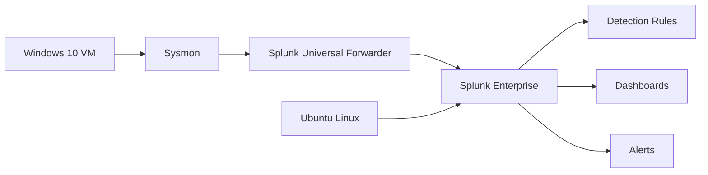
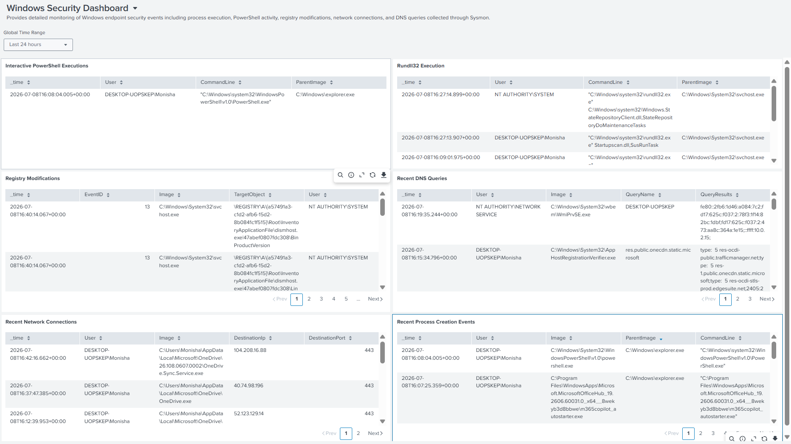
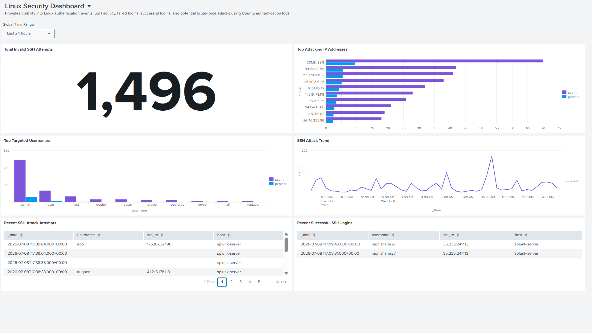

# 🛡️ SOC Detection Engineering Lab

A hands-on Security Operations Center (SOC) Detection Engineering Lab built using **Splunk Enterprise**, **Windows 10**, **Ubuntu Linux**, **Sysmon**, and the **Splunk Universal Forwarder**. This project demonstrates how to collect, monitor, detect, analyze, and correlate security events across Windows and Linux systems using real log sources and detection logic.

---

# 📌 Project Overview

The goal of this project is to simulate an enterprise SOC environment by collecting logs from multiple operating systems, creating detection rules, correlating suspicious activity, mapping detections to the MITRE ATT&CK framework, and visualizing security events through Splunk dashboards.

This repository demonstrates hands-on experience in:

- SOC Monitoring
- Detection Engineering
- Threat Hunting
- Security Log Analysis
- Splunk Dashboard Development
- MITRE ATT&CK Mapping

---

# 🎯 Objectives

* Build a centralized logging environment using Splunk Enterprise.
* Collect Windows and Linux logs in real time.
* Configure Sysmon for enhanced Windows telemetry.
* Create SPL-based detection rules.
* Build correlation searches for suspicious activities.
* Develop SOC dashboards for security monitoring.
* Document detections with investigation steps and MITRE ATT&CK mapping.

---

# 🏗️ Lab Architecture


---

# ⚙️ Technologies Used

* Splunk Enterprise
* Splunk Universal Forwarder
* Sysmon
* Ubuntu Linux
* Windows 10
* Oracle VirtualBox
* SPL (Search Processing Language)
* Git
* GitHub

---

# 📂 Repository Structure

```text
SOC-Detection-Engineering-Lab
│
├── alerts/
├── architecture/
├── correlation_searches/
├── dashboards/
├── detections/
│   ├── linux/
│   └── windows/
├── screenshots/
│   ├── alerts/
│   ├── dashboard/
│   ├── linux/
│   └── windows/
├── LICENSE
└── README.md

```

# 🚀 Features

This project demonstrates the following Security Operations Center (SOC) Detection Engineering capabilities:

- Centralized log collection using Splunk Enterprise
- Windows security monitoring using Sysmon
- Linux SSH authentication monitoring
- Detection engineering using SPL (Search Processing Language)
- Correlation searches for multi-stage attack detection
- Scheduled alerts for suspicious activities
- Interactive SOC dashboards
- MITRE ATT&CK technique mapping
- Windows and Linux security event analysis
- Comprehensive detection and alert documentation

---

# 🔍 Detection Use Cases

## Windows

* PowerShell Execution Monitoring
* Process Creation Monitoring
* Network Connection Monitoring
* DNS Query Monitoring
* Registry Modification Detection
* File Creation Monitoring
* Persistence Detection

## Linux

* SSH Authentication Monitoring
* Failed Login Detection
* Successful Login Detection
* SSH Brute Force Detection
* Authentication Log Analysis

---

# 🔗 Correlation Searches

This project includes correlation searches that combine multiple security events to identify suspicious behavior, including:

* SSH Brute Force → Successful Login
* PowerShell Execution → Network Connection
* Registry Modification → Process Execution
* PowerShell Activity → DNS Resolution

---

# 🎯 MITRE ATT&CK Coverage

The following MITRE ATT&CK techniques are demonstrated through the implemented detection rules and correlation searches.

| Tactic | Technique | Technique ID |
|---------|-----------|--------------|
| Execution | PowerShell | T1059.001 |
| Execution | Command and Scripting Interpreter | T1059 |
| Discovery | System Information Discovery | T1082 |
| Discovery | Network Service Discovery | T1046 |
| Persistence | Registry Run Keys / Startup Folder | T1547.001 |
| Credential Access | Brute Force | T1110 |
| Initial Access | External Remote Services (SSH) | T1133 |
| Defense Evasion | Signed Binary Proxy Execution (Certutil) | T1218 |
| Persistence | Valid Accounts | T1078 |

Additional mappings are documented within the corresponding detection and alert documentation.

---

# 📊 Dashboards

The project includes dashboards for monitoring:

* Windows Security Events
* Linux Authentication Events
* PowerShell Activity
* DNS Queries
* Network Connections
* Registry Changes
* SSH Activity
* SOC Overview

---
# 📸 Dashboard Preview

### SOC Overview Dashboard


---

### Windows Security Dashboard



---

### Linux Security Monitoring Dashboard



# 🚨 Sample Alerts

The project includes scheduled Splunk alerts for:

- PowerShell Execution Alert
- PowerShell Network Activity Alert
- Invalid User SSH Alert
- SSH Brute Force Alert

---

## 📈 Skills Demonstrated

### SIEM & Monitoring
- Splunk Enterprise
- Sysmon
- Log Analysis

### Detection Engineering
- SPL Query Development
- Alert Creation
- Correlation Searches

### Security Operations
- Incident Investigation
- Windows Security Monitoring
- Linux Security Monitoring

### Frameworks
- MITRE ATT&CK

### Operating Systems

- Windows 10
- Ubuntu Linux

---

# 🚀 Future Enhancements

- Expand Windows and Linux detection coverage
- Add Sigma rule support
- Integrate threat intelligence feeds
- Develop additional correlation searches
- Build custom Splunk dashboards
- Implement automated alert enrichment

---

# 📄 License

This project is shared for educational and portfolio purposes.
---

# 👩‍💻 Author

**Monisha M R**

Security Analyst | SOC Analyst Aspirant | Detection Engineering Enthusiast
---

### Skills

- Splunk Enterprise
- Sysmon
- Windows Security
- Linux Security
- SPL
- Threat Hunting
- MITRE ATT&CK
- Detection Engineering

GitHub: https://github.com/Monisha-krish

LinkedIn: https://linkedin.com/in/monisha-m-r-b27189260/

