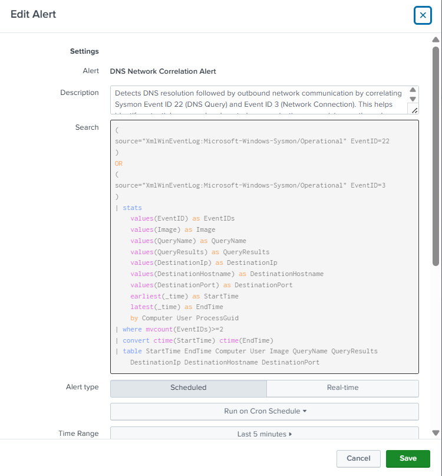
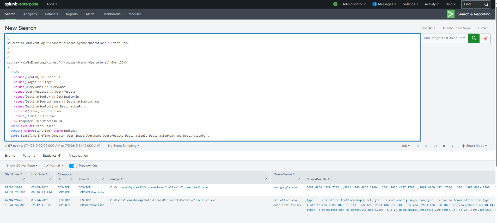

# DNS Network Correlation Alert

## Objective

Detect DNS resolution events that are followed by outbound network connections. This correlation combines Sysmon DNS Query (Event ID 22) and Network Connection (Event ID 3) events to identify processes that resolve domains and subsequently communicate with remote systems.

---

## Data Source

- Windows 10
- Sysmon
- Event ID 22 (DNS Query)
- Event ID 3 (Network Connection)

---

## SPL Query

```spl
(
source="XmlWinEventLog:Microsoft-Windows-Sysmon/Operational" EventID=22
)
OR
(
source="XmlWinEventLog:Microsoft-Windows-Sysmon/Operational" EventID=3
)
| stats
    values(EventID) as EventIDs
    values(Image) as Image
    values(QueryName) as QueryName
    values(QueryResults) as QueryResults
    values(DestinationIp) as DestinationIp
    values(DestinationHostname) as DestinationHostname
    values(DestinationPort) as DestinationPort
    earliest(_time) as StartTime
    latest(_time) as EndTime
    by Computer User ProcessGuid
| where mvcount(EventIDs)>=2
| convert ctime(StartTime) ctime(EndTime)
| table StartTime EndTime Computer User Image QueryName QueryResults DestinationIp DestinationHostname DestinationPort
```

---

## Alert Configuration

| Setting | Value |
|---------|-------|
| Alert Type | Scheduled |
| Schedule | Every 5 minutes (`*/5 * * * *`) |
| Time Range | Last 5 minutes |
| Trigger Condition | Number of Results > 0 |
| Trigger | Once |
| Severity | High |
| Permissions | Private |

---

## MITRE ATT&CK Mapping

| Tactic | Technique | Technique ID |
|---------|-----------|--------------|
| Command and Control | Application Layer Protocol | T1071 |
| Command and Control | Application Layer Protocol: DNS | T1071.004 |

---

## Investigation Steps

1. Review the queried domain.
2. Verify the resolved IP address.
3. Review the process that initiated the DNS request.
4. Check whether a network connection followed the DNS resolution.
5. Investigate the destination IP reputation.
6. Correlate with PowerShell or Certutil execution if present.
7. Review additional endpoint activity around the event.

---

## Why this Alert Matters

Most malware resolves a domain before communicating with its command-and-control infrastructure. Correlating DNS queries with outbound network connections provides stronger evidence of suspicious behavior than monitoring either event independently.

---

## Alert Tuning

- Exclude trusted internal domains.
- Exclude known Microsoft update services if appropriate.
- Prioritize newly observed or suspicious domains.
- Correlate with process execution for additional context.

---

## Screenshot

### Alert Configuration



### Triggered Alert

