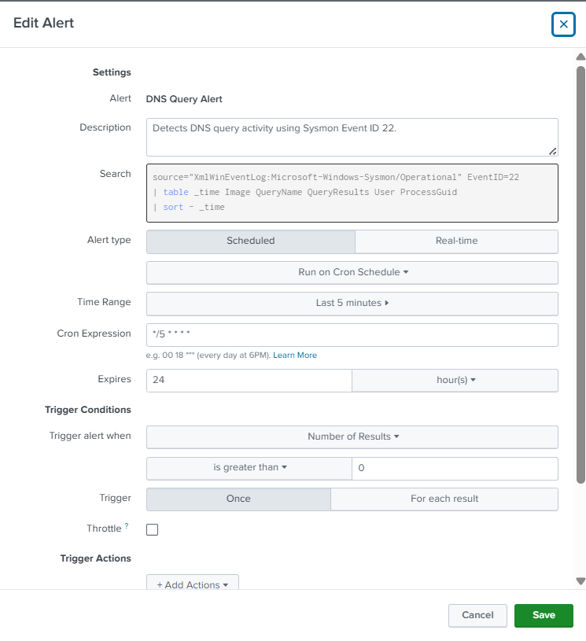
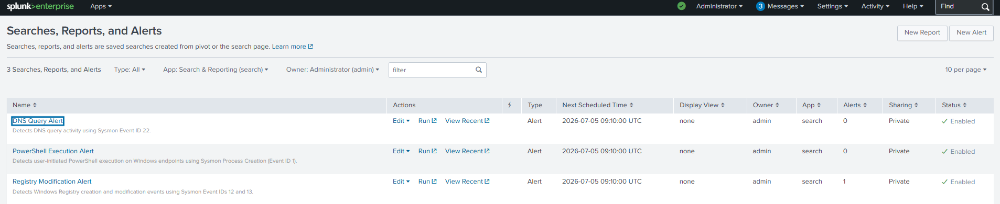

# DNS Query Alert

## Objective

Detect DNS query activity on Windows endpoints using Sysmon Event ID 22. DNS monitoring helps identify suspicious domain lookups that may indicate malware communication, command-and-control (C2) activity, phishing, or other malicious network behavior.

---

## Data Source

- Windows 10
- Sysmon
- Event ID 22 (DNS Query)

---

## SPL Query

```spl
source="XmlWinEventLog:Microsoft-Windows-Sysmon/Operational" EventID=22
| table _time Image QueryName QueryResults User ProcessGuid
| sort - _time
```

---

## Alert Configuration

| Setting | Value |
|---------|-------|
| Alert Type | Scheduled |
| Schedule | Every 5 minutes (`*/5 * * * *`) |
| Time Range | Last 5 minutes |
| Trigger Condition | Number of Results > 0 |
| Trigger | Once |
| Severity | Medium |
| Permissions | Private |

---

## Investigation Steps

1. Identify the process that initiated the DNS query.
2. Review the queried domain (`QueryName`).
3. Check whether the domain is trusted or suspicious.
4. Investigate the resolved IP address (`QueryResults`).
5. Correlate with network connection events (Sysmon Event ID 3).
6. Correlate with PowerShell or other process execution events.
7. Search threat intelligence sources for known malicious domains.

---

## MITRE ATT&CK Mapping

| Tactic | Technique | Technique ID |
|---------|-----------|--------------|
| Command and Control | Application Layer Protocol: DNS | T1071.004 |

---

## Why this Alert Matters

Attackers frequently use DNS to resolve malicious domains before establishing outbound connections to command-and-control infrastructure. Monitoring DNS queries enables SOC analysts to identify suspicious communication patterns, detect malware activity, and investigate potential compromises at an early stage.

---

## Alert Tuning

To reduce false positives:

- Exclude trusted internal domains if appropriate.
- Focus on newly observed or suspicious domains.
- Correlate DNS activity with process execution and network connections before escalating.

---

## Screenshot

### Alert Configuration



### Triggered Alert

