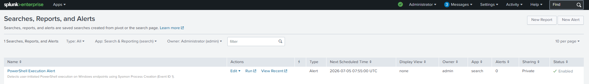
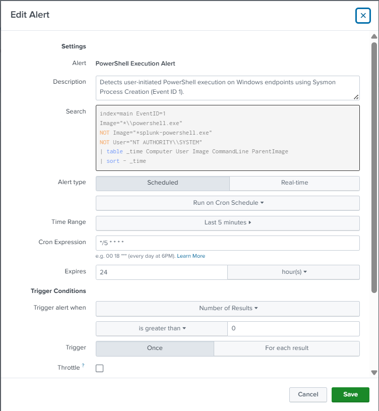

# PowerShell Execution Alert

## Objective

Detect user-initiated PowerShell execution on Windows endpoints by monitoring Sysmon Process Creation events (Event ID 1). Since PowerShell is a legitimate administrative tool that is frequently abused by attackers, this alert helps SOC analysts quickly identify suspicious PowerShell activity for further investigation while reducing false positives by excluding known Splunk processes and SYSTEM account executions.

---

## Data Source

- Windows 10
- Sysmon
- Event ID 1 (Process Creation)

---

## SPL Query

```spl
index=main EventID=1
Image="*\\powershell.exe"
NOT Image="*splunk-powershell.exe"
NOT User="NT AUTHORITY\\SYSTEM"
| table _time Computer User Image CommandLine ParentImage
| sort - _time
```

---

## Alert Configuration

| Setting | Value |
|---------|-------|
| Alert Type | Scheduled |
| Schedule | Every 5 minutes (`*/5 * * * *`) |
| Time Range | Last 5 minutes |
| Trigger Condition | Number of Results > 0 |
| Trigger | Once |
| Severity | Medium |
| Permissions | Private |

---

## Investigation Steps

1. Verify the user who launched PowerShell.
2. Review the parent process that spawned PowerShell.
3. Inspect the full command line for suspicious arguments.
4. Determine whether the execution was interactive or script-based.
5. Correlate with Sysmon Event ID 3 (Network Connection).
6. Correlate with Sysmon Event ID 22 (DNS Query).
7. Check for registry modifications or persistence mechanisms.
8. Review additional endpoint activity around the same timestamp.

---

## MITRE ATT&CK Mapping

| Tactic | Technique | Technique ID |
|---------|-----------|--------------|
| Execution | Command and Scripting Interpreter: PowerShell | T1059.001 |

---

## Why this Alert Matters

PowerShell is one of the most commonly abused Windows utilities used by attackers for malware execution, downloading payloads, credential theft, privilege escalation, lateral movement, and post-exploitation activities. Monitoring PowerShell execution enables SOC analysts to rapidly identify suspicious behavior while filtering out known benign processes to reduce alert fatigue.

---

## Alert Tuning

To reduce false positives, the following exclusions were implemented:

- Excluded `splunk-powershell.exe` generated by the Splunk Universal Forwarder.
- Excluded executions performed by the `NT AUTHORITY\SYSTEM` account.
- Focused on user-initiated PowerShell executions.

These tuning measures improve alert quality by minimizing benign system activity while retaining visibility into potentially malicious PowerShell usage.

---

## Screenshot

### Alert Configuration



### Triggered Alert

