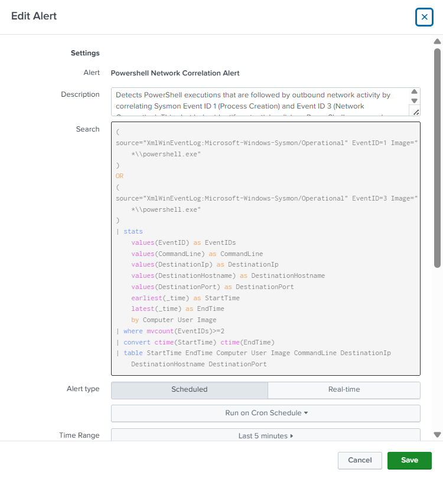
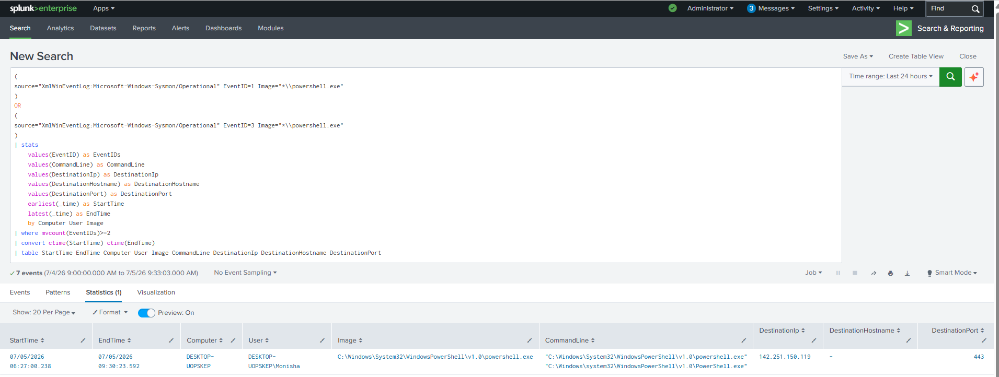

# PowerShell Network Correlation Alert

## Objective

Detect PowerShell executions that are associated with outbound network connections by correlating Sysmon Process Creation (Event ID 1) and Network Connection (Event ID 3) events. This correlation helps identify potentially malicious PowerShell activity involving payload downloads, command-and-control (C2) communication, or other suspicious network behavior.

---

## Data Source

- Windows 10
- Sysmon
- Event ID 1 (Process Creation)
- Event ID 3 (Network Connection)

---

## SPL Query

```spl
(
source="XmlWinEventLog:Microsoft-Windows-Sysmon/Operational" EventID=1 Image="*\\powershell.exe"
)
OR
(
source="XmlWinEventLog:Microsoft-Windows-Sysmon/Operational" EventID=3 Image="*\\powershell.exe"
)
| stats
    values(EventID) as EventIDs
    values(CommandLine) as CommandLine
    values(DestinationIp) as DestinationIp
    values(DestinationHostname) as DestinationHostname
    values(DestinationPort) as DestinationPort
    earliest(_time) as StartTime
    latest(_time) as EndTime
    by Computer User Image
| where mvcount(EventIDs)>=2
| convert ctime(StartTime) ctime(EndTime)
| table StartTime EndTime Computer User Image CommandLine DestinationIp DestinationHostname DestinationPort
```

---

## Sample Output

| Start Time | End Time | Computer | User | Destination IP | Port |
|------------|----------|----------|------|----------------|------|
| 2026-07-05 06:27:00 | 2026-07-05 09:30:23 | DESKTOP-UOPSKEP | DESKTOP-UOPSKEP\Monisha | 142.251.150.119 | 443 |

---

## Alert Configuration

| Setting | Value |
|---------|-------|
| Alert Type | Scheduled |
| Schedule | Every 5 minutes (`*/5 * * * *`) |
| Time Range | Last 5 minutes |
| Trigger Condition | Number of Results > 0 |
| Trigger | Once |
| Severity | High |
| Permissions | Private |

---

## MITRE ATT&CK Mapping

| Tactic | Technique | Technique ID |
|---------|-----------|--------------|
| Execution | Command and Scripting Interpreter: PowerShell | T1059.001 |
| Command and Control | Application Layer Protocol | T1071 |

---

## Investigation Steps

1. Verify the user who executed PowerShell.
2. Review the complete PowerShell command line.
3. Identify the destination IP address and hostname.
4. Check the destination IP using threat intelligence sources.
5. Verify whether the destination port is expected.
6. Correlate with DNS Query events (Sysmon Event ID 22).
7. Check for registry modifications or persistence activity.
8. Review additional process activity on the endpoint.
9. Determine whether the activity is legitimate or potentially malicious.

---

## Why this Alert Matters

PowerShell is frequently abused by attackers to download malware, execute malicious scripts, establish command-and-control (C2) communication, and perform post-exploitation activities. Correlating PowerShell execution with outbound network activity significantly reduces false positives compared to monitoring either event independently and provides SOC analysts with stronger evidence of suspicious behavior.

---

## Alert Tuning

To reduce false positives:

- Exclude trusted administrative PowerShell scripts if appropriate.
- Exclude known internal management servers.
- Correlate with DNS query events for additional context.
- Investigate only unexpected external IP addresses.
- Review command-line arguments before escalating the alert.

---

## Screenshot

### Alert Configuration



### Triggered Alert

