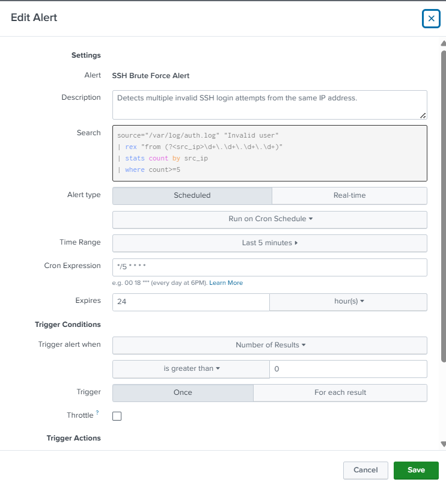
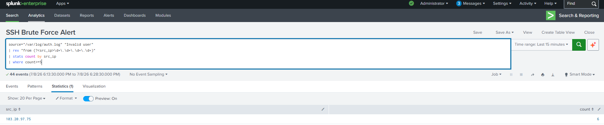

# SSH Brute Force Alert

## Objective

Detect potential SSH brute-force attacks by identifying source IP addresses generating multiple invalid SSH login attempts within a short period. This alert enables early detection of password-guessing attacks against Linux systems.

---

## Alert Logic

The alert monitors the Linux authentication log (`/var/log/auth.log`) for repeated **"Invalid user"** events. If a source IP address generates **five or more** invalid login attempts, the alert is triggered.

---

## SPL Query

```spl
source="/var/log/auth.log" "Invalid user"
| rex "from (?<src_ip>\d+\.\d+\.\d+\.\d+)"
| stats count by src_ip
| where count>=5
| sort - count
```

---

## Alert Configuration

| Setting | Value |
|----------|-------|
| Alert Name | SSH Brute Force Alert |
| Alert Type | Scheduled |
| Schedule | Every 5 minutes |
| Cron Expression | `*/5 * * * *` |
| Time Range | Last 5 minutes |
| Trigger Condition | Number of Results > 0 |
| Trigger | Once |
| Severity | High |

---

## MITRE ATT&CK Mapping

| Tactic | Technique | Technique ID |
|---------|-----------|--------------|
| Credential Access | Brute Force | T1110 |
| Initial Access | External Remote Services | T1133 |

---

## Investigation Steps

1. Identify the source IP responsible for repeated authentication attempts.
2. Review the number of failed login attempts.
3. Determine which usernames were targeted.
4. Correlate with successful SSH login events to verify whether authentication eventually succeeded.
5. Review firewall, IDS/IPS, or cloud logs for additional malicious activity.
6. Block or rate-limit the offending IP address if malicious activity is confirmed.

---

## Expected Outcome

This alert enables SOC analysts to rapidly identify SSH brute-force attacks and respond before attackers successfully compromise Linux systems.

---

## Screenshot

### Alert Configuration

```

```

### Triggered Alert

```

```