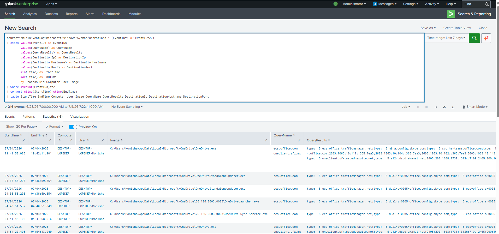

# DNS Query Followed by Network Connection Correlation

## Objective

Detect processes that perform DNS queries followed by outbound network connections by correlating Sysmon DNS Query (Event ID 22) and Network Connection (Event ID 3) events. This correlation helps identify applications resolving domain names before establishing communication with external systems.

---

## Data Sources

- Windows 10
- Sysmon
- Event ID 22 (DNS Query)
- Event ID 3 (Network Connection)

---

## Detection Logic

Correlate DNS query events with outbound network connection events generated by the same process using the **ProcessGuid** field. If a process performs both a DNS lookup and a network connection, generate a correlated event for investigation.

---

## SPL Query

```spl
source="XmlWinEventLog:Microsoft-Windows-Sysmon/Operational" (EventID=3 OR EventID=22)
| stats values(EventID) as EventIDs
        values(QueryName) as QueryName
        values(QueryResults) as QueryResults
        values(DestinationIp) as DestinationIp
        values(DestinationHostname) as DestinationHostname
        values(DestinationPort) as DestinationPort
        min(_time) as StartTime
        max(_time) as EndTime
        by ProcessGuid Computer User Image
| where mvcount(EventIDs)>=2
| convert ctime(StartTime) ctime(EndTime)
| table StartTime EndTime Computer User Image QueryName QueryResults DestinationIp DestinationHostname DestinationPort
```

---

## Sample Output

| Start Time | End Time | Computer | User | Process | DNS Query | Destination IP | Port |
|------------|----------|----------|------|---------|-----------|----------------|------|
|2026-07-05 10:15:42|2026-07-05 10:15:43|WIN10-LAB|Monisha|powershell.exe|example.com|93.184.216.34|443|

---

## Investigation Steps

1. Identify the process that performed the DNS query.
2. Review the queried domain name.
3. Verify the destination IP address and hostname.
4. Check the reputation of the domain and IP using threat intelligence sources (e.g., VirusTotal, Cisco Talos, AlienVault OTX).
5. Determine whether the destination is expected for the environment.
6. Review additional activity associated with the same **ProcessGuid**, such as PowerShell execution, registry modifications, or file creation.
7. Investigate repeated connections to unknown or suspicious domains.

---

## MITRE ATT&CK Mapping

| Tactic | Technique | Technique ID |
|---------|-----------|--------------|
|Command and Control|Application Layer Protocol|T1071|
|Command and Control|Application Layer Protocol: DNS|T1071.004|

---

## Why this Detection Matters

Most applications resolve a domain name before establishing a network connection. Threat actors frequently use this sequence when communicating with command-and-control (C2) servers, downloading malware, or accessing malicious infrastructure. Correlating DNS queries with subsequent network connections provides additional context, reduces false positives, and enables SOC analysts to identify suspicious communication patterns more effectively.

---

## Screenshot

