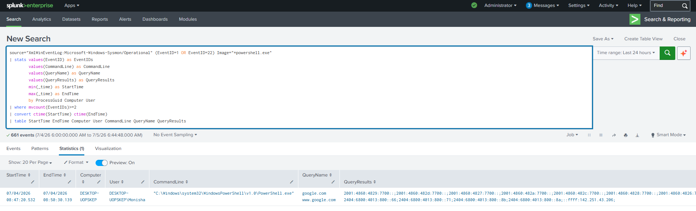

# PowerShell Followed by DNS Query Correlation

## Objective

Detect PowerShell processes that perform DNS queries by correlating Sysmon Process Creation (Event ID 1) with DNS Query events (Event ID 22). This correlation helps identify PowerShell-based reconnaissance, malware download attempts, command-and-control (C2) communication, and other suspicious activities.

---

## Data Sources

- Windows 10
- Sysmon
- Event ID 1 (Process Creation)
- Event ID 22 (DNS Query)

---

## Detection Logic

Correlate PowerShell process creation events with DNS query events using the **ProcessGuid** field. If the same PowerShell process performs one or more DNS lookups, generate a correlated result for investigation.

---

## SPL Query

```spl
source="XmlWinEventLog:Microsoft-Windows-Sysmon/Operational" (EventID=1 OR EventID=22) Image="*powershell.exe"
| stats values(EventID) as EventIDs
        values(CommandLine) as CommandLine
        values(QueryName) as QueryName
        values(QueryResults) as QueryResults
        min(_time) as StartTime
        max(_time) as EndTime
        by ProcessGuid Computer User
| where mvcount(EventIDs)>=2
| convert ctime(StartTime) ctime(EndTime)
| table StartTime EndTime Computer User CommandLine QueryName QueryResults
```

---

## Sample Output

| Start Time | End Time | Computer | User | Command Line | DNS Query | Query Results |
|------------|----------|----------|------|--------------|-----------|---------------|
|2026-07-04 10:45:12|2026-07-04 10:45:14|DESKTOP-01|Monisha|powershell.exe -Command nslookup google.com|google.com|142.250.xxx.xxx|

---

## Investigation Steps

1. Verify the user who executed PowerShell.
2. Review the PowerShell command line for suspicious commands or encoded content.
3. Identify the domain(s) queried by PowerShell.
4. Check the reputation of the queried domains using threat intelligence platforms (e.g., VirusTotal, Cisco Talos, AlienVault OTX).
5. Determine whether the DNS query was followed by a network connection (Sysmon Event ID 3).
6. Review additional activities performed by the same PowerShell process using the **ProcessGuid**.
7. Investigate any subsequent file downloads, registry modifications, or child processes associated with the PowerShell execution.

---

## MITRE ATT&CK Mapping

| Tactic | Technique | Technique ID |
|---------|-----------|--------------|
|Execution|Command and Scripting Interpreter: PowerShell|T1059.001|
|Command and Control|Application Layer Protocol: DNS|T1071.004|

---

## Why this Detection Matters

PowerShell is a powerful administrative tool that is frequently abused by attackers to execute malicious scripts, perform reconnaissance, download payloads, and communicate with command-and-control (C2) infrastructure. Correlating PowerShell execution with DNS activity significantly reduces false positives compared to monitoring either event independently. This detection provides SOC analysts with valuable context to quickly identify suspicious PowerShell behavior and prioritize investigations.

---

## Screenshot

