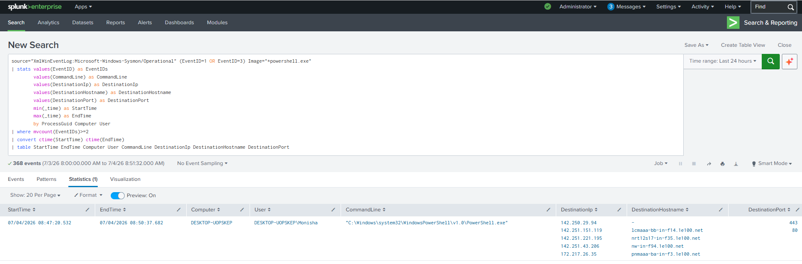

# PowerShell Followed by Network Connection

## Objective

Detect PowerShell processes that establish outbound network connections. This correlation search identifies potentially malicious PowerShell activity communicating with external systems.

---

## Data Sources

- Windows 10
- Sysmon Event ID 1 (Process Creation)
- Sysmon Event ID 3 (Network Connection)

---

## Detection Logic

Correlate PowerShell process creation events with subsequent outbound network connections using the ProcessGuid field.

---

## SPL Query

```spl
source="XmlWinEventLog:Microsoft-Windows-Sysmon/Operational" (EventID=1 OR EventID=3) Image="*powershell.exe"
| stats values(EventID) as EventIDs
        values(CommandLine) as CommandLine
        values(DestinationIp) as DestinationIp
        values(DestinationHostname) as DestinationHostname
        values(DestinationPort) as DestinationPort
        min(_time) as StartTime
        max(_time) as EndTime
        by ProcessGuid Computer User
| where mvcount(EventIDs)>=2
| convert ctime(StartTime) ctime(EndTime)
| table StartTime EndTime Computer User CommandLine DestinationIp DestinationHostname DestinationPort
```

---

## Sample Output

| Computer | User | Destination IP | Port |
|----------|------|----------------|------|
|DESKTOP-01|Monisha|142.xxx.xxx.xxx|443|

---

## Investigation Steps

1. Review the PowerShell command line.
2. Identify the destination IP and hostname.
3. Verify IP reputation using threat intelligence.
4. Determine whether the connection is expected.
5. Investigate additional Sysmon events associated with the same ProcessGuid.

---

## MITRE ATT&CK

| Tactic | Technique | ID |
|---------|-----------|----|
|Execution|PowerShell|T1059.001|
|Command and Control|Application Layer Protocol|T1071|

---

## Why this Detection Matters

PowerShell is one of the most abused tools in Windows environments. When a PowerShell process immediately establishes a network connection, it may indicate malware execution, payload download, or command-and-control communication. Correlating process creation with network activity significantly reduces false positives and improves detection fidelity.

---

## Screenshot

