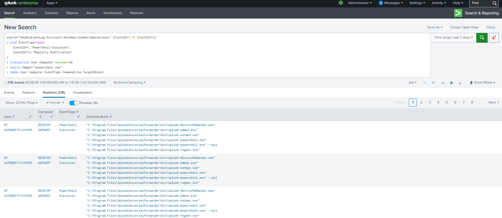

# PowerShell Followed by Registry Modification Correlation

## Objective

Detect PowerShell executions that are followed by Windows Registry modifications. This correlation search combines Sysmon Process Creation (Event ID 1) and Registry Modification (Event ID 13) events occurring within a short time window for the same user and computer. This helps identify suspicious PowerShell activity that modifies the Windows Registry.

---

## Data Sources

- Windows 10
- Sysmon
- Event ID 1 (Process Creation)
- Event ID 13 (Registry Value Set)

---

## Detection Logic

Correlate PowerShell process creation with registry modification events performed by the same user on the same computer within a two-minute time window. This approach provides additional context during investigations when direct process correlation is unavailable.

---

## SPL Query

```spl
source="XmlWinEventLog:Microsoft-Windows-Sysmon/Operational" (EventID=1 OR EventID=13)
| eval EventType=case(
    EventID=1,"PowerShell Execution",
    EventID=13,"Registry Modification"
)
| transaction User Computer maxspan=2m
| search Image="*powershell.exe"
| table User Computer EventType CommandLine TargetObject
```

---

## Sample Output

| User | Computer | Event Type | Command Line | Registry Key |
|------|----------|------------|--------------|--------------|
|Monisha|WIN10-LAB|PowerShell Execution, Registry Modification|powershell.exe New-ItemProperty...|HKCU\Software\MonishaLab\TestValue|

---

## Investigation Steps

1. Verify the user who launched PowerShell.
2. Review the PowerShell command line for suspicious commands or encoded scripts.
3. Identify the registry key that was modified.
4. Determine whether the modified registry path is associated with persistence or system configuration.
5. Verify whether the registry change was expected.
6. Correlate with DNS queries (Sysmon Event ID 22) and network connections (Sysmon Event ID 3).
7. Investigate additional activities associated with the same user during the correlation window.

---

## MITRE ATT&CK Mapping

| Tactic | Technique | Technique ID |
|---------|-----------|--------------|
|Execution|Command and Scripting Interpreter: PowerShell|T1059.001|
|Defense Evasion|Modify Registry|T1112|

> **Note:** If the registry modification targets autorun locations such as:
>
> - `HKCU\Software\Microsoft\Windows\CurrentVersion\Run`
> - `HKLM\Software\Microsoft\Windows\CurrentVersion\Run`
>
> the activity may also be mapped to:
>
> **Tactic:** Persistence
>
> **Technique:** T1547.001 – Registry Run Keys / Startup Folder

---

## Why this Detection Matters

PowerShell is commonly abused by attackers to automate registry modifications for changing system configurations, disabling security controls, or establishing persistence. Correlating PowerShell execution with registry modifications provides analysts with additional context, reduces investigation time, and improves the identification of potentially malicious activity.

Unlike single-event detections, this correlation search highlights related activities occurring within a defined time window, making it more effective for identifying suspicious behavior during incident investigations.

---

## Screenshot

