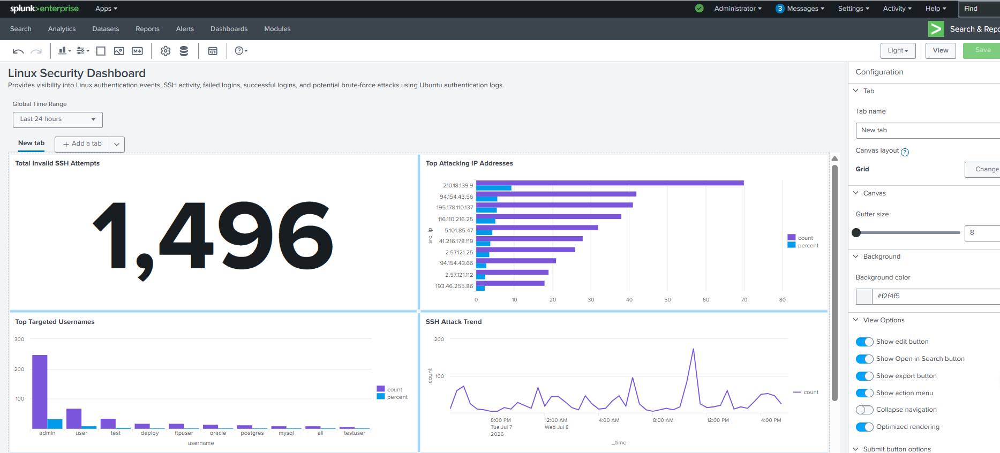

# Linux SSH Threat Monitoring Dashboard

## Objective

The Linux SSH Threat Monitoring Dashboard provides visibility into SSH authentication activity on Ubuntu systems by monitoring failed login attempts, successful logins, attacker IP addresses, and targeted usernames using `/var/log/auth.log`.

---

# Dashboard Components

## 1. Total Invalid SSH Attempts

### Objective

Display the total number of invalid SSH login attempts.

### SPL Query

```spl
source="/var/log/auth.log" "Invalid user"
| stats count as "Invalid SSH Attempts"
```

---

## 2. Top Attacking IP Addresses

### Objective

Identify the IP addresses generating the highest number of invalid SSH login attempts.

### SPL Query

```spl
source="/var/log/auth.log" "Invalid user"
| rex "from (?<src_ip>\d+\.\d+\.\d+\.\d+)"
| top limit=10 src_ip
```

---

## 3. SSH Attack Trend

### Objective

Visualize SSH attack activity over time.

### SPL Query

```spl
source="/var/log/auth.log" "Invalid user"
| timechart count
```

---

## 4. Top Targeted Usernames

### Objective

Identify usernames most frequently targeted by attackers.

### SPL Query

```spl
source="/var/log/auth.log" "Invalid user"
| rex "Invalid user (?<username>\S+)"
| top limit=10 username
```

---

## 5. Recent SSH Attack Attempts

### Objective

Display the latest invalid SSH login attempts.

### SPL Query

```spl
source="/var/log/auth.log" "Invalid user"
| rex "Invalid user (?<username>\S+)"
| rex "from (?<src_ip>\d+\.\d+\.\d+\.\d+)"
| table _time username src_ip host
| sort - _time
```

---

## 6. Recent Successful SSH Logins

### Objective

Display successful SSH logins authenticated using public key authentication.

### SPL Query

```spl
source="/var/log/auth.log" "Accepted publickey"
| rex "Accepted publickey for (?<username>\S+)"
| rex "from (?<src_ip>\d+\.\d+\.\d+\.\d+)"
| table _time username src_ip host
| sort - _time
```

---

# MITRE ATT&CK Mapping

| Tactic | Technique | Technique ID |
|---------|-----------|--------------|
| Credential Access | Brute Force | T1110 |
| Initial Access | External Remote Services | T1133 |
| Persistence | Valid Accounts | T1078 |

---

# Investigation Use Cases

- Monitor SSH brute-force attempts
- Identify attacker IP addresses
- Review targeted usernames
- Detect successful administrator logins
- Support Linux threat hunting and incident investigations

---

# Benefits

This dashboard provides centralized monitoring of SSH authentication activity, enabling analysts to quickly identify brute-force attacks, distinguish legitimate administrative access from malicious attempts, and investigate suspicious login behavior.

---

# Screenshots

### Dashboard (Edit Mode)


### Dashboard (View Mode)

