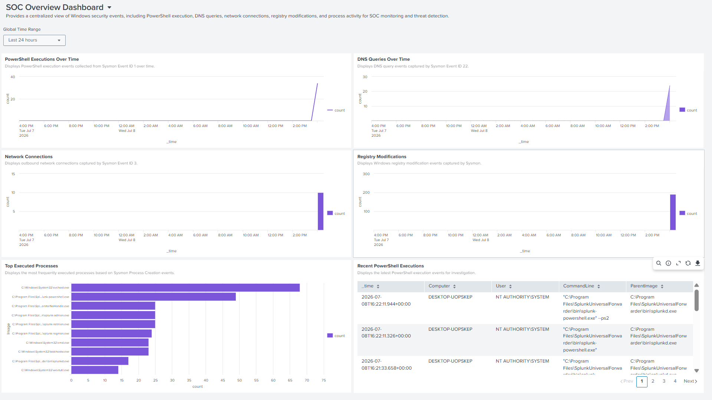
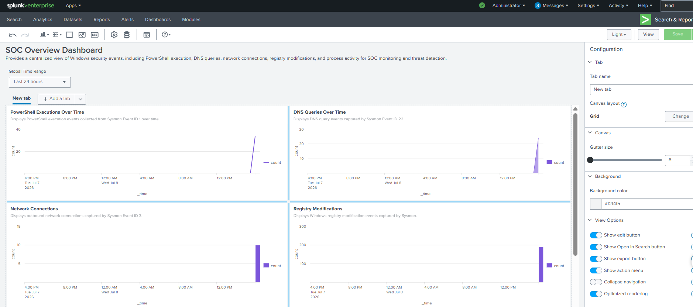

# SOC Overview Dashboard

## Objective

The SOC Overview Dashboard provides a centralized view of key Windows security events collected through Splunk Enterprise. It enables SOC analysts to quickly identify suspicious activities, investigate security incidents, and monitor endpoint behavior using real-time telemetry from Sysmon.

---

## Dashboard Components

### 1. PowerShell Executions Over Time

**Objective**

Monitor PowerShell execution activity to identify suspicious scripting behavior.

**SPL Query**

```spl
index=main EventID=1 Image="*powershell.exe"
| timechart count
```

---

### 2. DNS Queries Over Time

**Objective**

Monitor DNS query activity generated by Windows endpoints.

**SPL Query**

```spl
index=main EventID=22
| timechart count
```

---

### 3. Network Connections

**Objective**

Monitor outbound network connections to identify potential command-and-control communication.

**SPL Query**

```spl
index=main EventID=3
| timechart count
```

---

### 4. Registry Modifications

**Objective**

Track Windows Registry modifications for suspicious system changes.

**SPL Query**

```spl
index=main (EventID=12 OR EventID=13)
| timechart count
```

---

### 5. Top Executed Processes

**Objective**

Identify the most frequently executed processes within the monitored environment.

**SPL Query**

```spl
index=main EventID=1
| stats count by Image
| sort -count
| head 10
```

---

### 6. Recent PowerShell Executions

**Objective**

Display the latest PowerShell execution events to support rapid investigation.

**SPL Query**

```spl
index=main EventID=1 Image="*powershell.exe"
| table _time Computer User CommandLine ParentImage
| sort - _time
```

---

## Investigation Use Cases

The dashboard helps SOC analysts to:

- Monitor PowerShell activity
- Identify abnormal DNS activity
- Review outbound network connections
- Detect registry modifications
- Investigate recently executed commands
- Identify frequently executed processes
- Support threat hunting activities

---

## MITRE ATT&CK Coverage

| Tactic | Technique | Technique ID |
|---------|-----------|--------------|
| Execution | PowerShell | T1059.001 |
| Command and Control | Application Layer Protocol | T1071 |
| Command and Control | DNS | T1071.004 |
| Defense Evasion | Registry Modification | T1112 |

---

## Benefits

This dashboard provides a high-level operational overview of Windows endpoint activity. By combining multiple security event sources into a single interface, analysts can rapidly detect suspicious behavior, prioritize investigations, and correlate related events during incident response.

---

## Screenshots

### Dashboard (Edit Mode)



### Dashboard (View Mode)

