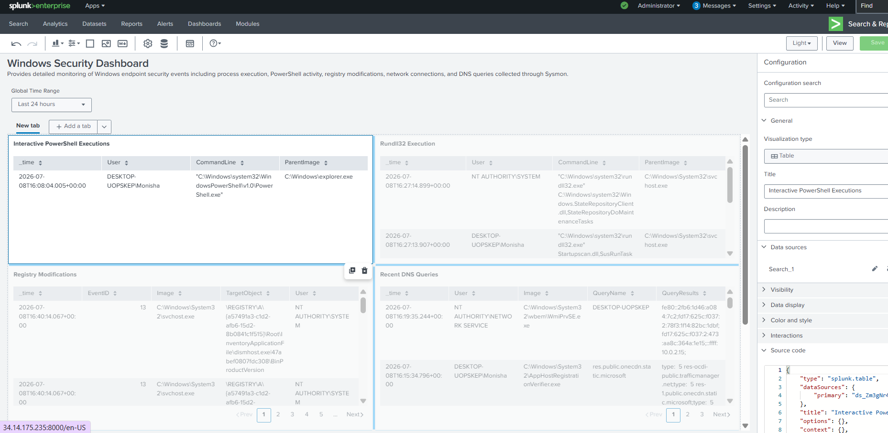

# Windows Security Dashboard

## Objective

The Windows Security Dashboard provides detailed visibility into Windows endpoint activity using Sysmon telemetry collected in Splunk Enterprise. It enables SOC analysts to monitor process execution, PowerShell activity, registry modifications, DNS queries, and network connections for threat detection and investigation.

---

# Dashboard Components

## 1. Interactive PowerShell Executions

### Objective

Monitor PowerShell sessions launched interactively by users.

### SPL Query

```spl
index=main EventID=1 Image="*powershell.exe"
| search ParentImage="*explorer.exe"
| table _time User CommandLine ParentImage
| sort - _time
```

---

## 2. Rundll32 Executions

### Objective

Monitor executions of rundll32.exe, which attackers often abuse for proxy execution.

### SPL Query

```spl
source="XmlWinEventLog:Microsoft-Windows-Sysmon/Operational" EventID=1
| search Image="*\\rundll32.exe"
| table _time User CommandLine ParentImage
| sort - _time
```

---

## 3. Recent Process Creation Events

### Objective

Display recently created Windows processes for monitoring and investigation.

### SPL Query

```spl
index=main EventID=1
| table _time User Image ParentImage CommandLine
| sort - _time
```

---

## 4. Registry Modifications

### Objective

Monitor Windows Registry changes that may indicate suspicious activity or persistence.

### SPL Query

```spl
source="XmlWinEventLog:Microsoft-Windows-Sysmon/Operational" (EventID=12 OR EventID=13)
| table _time EventID Image TargetObject User
| sort - _time
```

---

## 5. DNS Queries

### Objective

Monitor DNS requests initiated by Windows processes.

### SPL Query

```spl
source="XmlWinEventLog:Microsoft-Windows-Sysmon/Operational" EventID=22
| table _time User Image QueryName QueryResults
| sort - _time
```

---

## 6. Network Connections

### Objective

Monitor outbound network connections initiated by Windows processes.

### SPL Query

```spl
index=main EventID=3
| table _time User Image DestinationIp DestinationPort
| sort - _time
```

---

# Investigation Use Cases

The dashboard enables SOC analysts to:

- Monitor interactive PowerShell usage
- Identify suspicious Rundll32 executions
- Review newly created processes
- Investigate registry changes
- Analyze DNS activity
- Monitor outbound network connections
- Support endpoint threat hunting

---

# MITRE ATT&CK Coverage

| Tactic | Technique | Technique ID |
|---------|-----------|--------------|
| Execution | PowerShell | T1059.001 |
| Execution | Rundll32 | T1218.011 |
| Defense Evasion | Registry Modification | T1112 |
| Command and Control | Application Layer Protocol | T1071 |
| Command and Control | DNS | T1071.004 |

---

# Benefits

This dashboard provides detailed endpoint visibility for Windows hosts, enabling analysts to investigate suspicious behavior, validate alerts, and perform threat hunting using Sysmon telemetry.

---

# Screenshots

### Dashboard (Edit Mode)


### Dashboard (View Mode)

