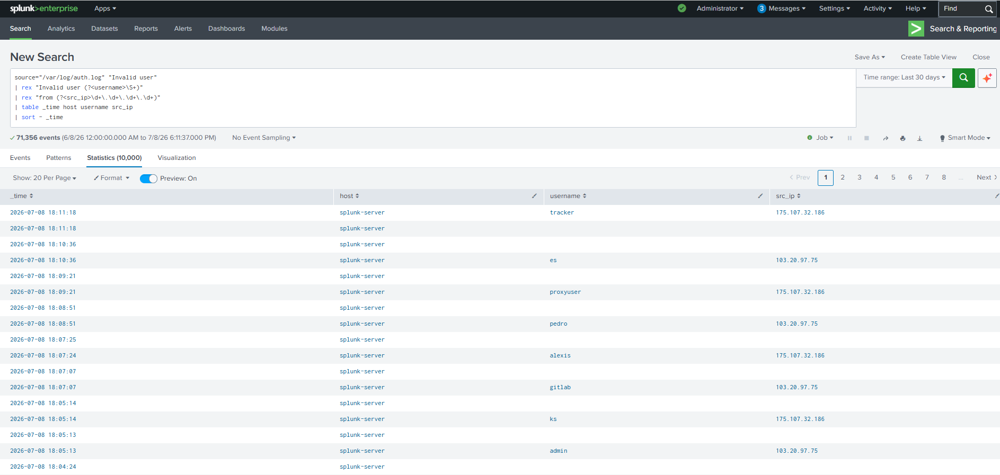

# Invalid User Detection

## Objective

Detect SSH login attempts targeting invalid or non-existent user accounts on Linux systems. Such events often indicate automated scanning, brute-force attacks, or reconnaissance activity against SSH services.

---

## Detection Logic

This detection monitors the Linux authentication log (`/var/log/auth.log`) for SSH events containing the **"Invalid user"** message generated by the OpenSSH daemon.

---

## SPL Query

```spl
source="/var/log/auth.log" "Invalid user"
| rex "Invalid user (?<username>\S+)"
| rex "from (?<src_ip>\d+\.\d+\.\d+\.\d+)"
| table _time host username src_ip
| sort - _time
```

---

## Sample Output

| Time | Host | Username | Source IP |
|------|------|----------|-----------|
| 2026-07-08 17:34:03 | splunk-server | droidbot | 175.107.32.186 |
| 2026-07-08 17:32:53 | splunk-server | user | 198.38.94.13 |
| 2026-07-08 17:32:51 | splunk-server | admin | 198.38.94.13 |

---

## Why This Detection Matters

Attackers frequently attempt to authenticate using common usernames such as:

- admin
- root
- user
- test
- ubuntu
- oracle

Repeated invalid user attempts may indicate:

- SSH brute-force attacks
- Internet-wide scanning
- Credential stuffing attempts
- Automated reconnaissance

Monitoring these events enables SOC analysts to identify malicious authentication activity at an early stage.

---

## MITRE ATT&CK Mapping

| Tactic | Technique | Technique ID |
|---------|-----------|--------------|
| Credential Access | Brute Force | T1110 |
| Initial Access | External Remote Services | T1133 |

---

## Investigation Steps

1. Review the source IP address associated with the login attempt.
2. Identify the targeted username.
3. Check whether multiple usernames are being targeted from the same IP address.
4. Correlate with other SSH authentication events such as successful logins or disconnect events.
5. Determine whether the source IP has generated repeated authentication attempts.
6. Block or restrict the source IP if malicious activity is confirmed.

---

## Expected Outcome

This detection provides early visibility into SSH reconnaissance and brute-force attempts by identifying authentication requests targeting invalid user accounts. It helps analysts distinguish malicious login attempts from legitimate administrative activity.

---

## Screenshot


