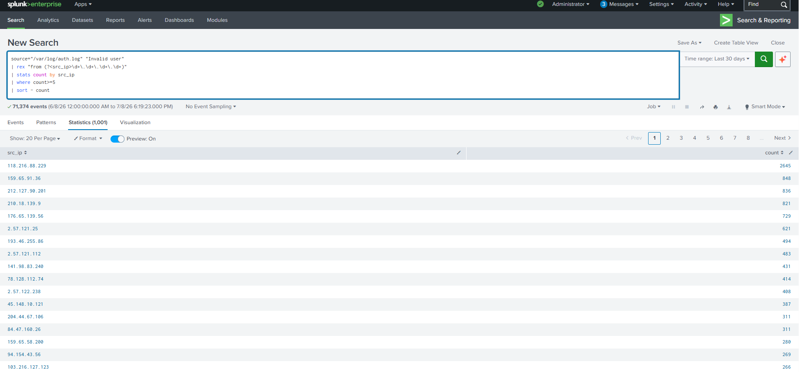

# SSH Brute Force Detection

## Objective

Detect potential SSH brute-force attacks by identifying source IP addresses that generate multiple invalid SSH login attempts within the Linux authentication logs. This detection helps SOC analysts identify automated password-guessing attacks and unauthorized access attempts.

---

## Detection Logic

This detection monitors the Linux authentication log (`/var/log/auth.log`) for repeated **"Invalid user"** events originating from the same source IP address. If an IP address generates five or more invalid login attempts, it is flagged as a potential brute-force attack.

---

## SPL Query

```spl
source="/var/log/auth.log" "Invalid user"
| rex "from (?<src_ip>\d+\.\d+\.\d+\.\d+)"
| stats count by src_ip
| where count>=5
| sort - count
```

---

## Sample Output

| Source IP | Failed Attempts |
|-----------|----------------:|
| 198.38.94.13 | 24 |
| 175.107.32.186 | 12 |

---

## Why This Detection Matters

SSH brute-force attacks are one of the most common methods attackers use to gain unauthorized access to Linux servers. Automated tools continuously attempt to authenticate using common usernames and passwords.

Monitoring repeated authentication attempts enables analysts to:

- Detect brute-force attacks early.
- Identify malicious source IP addresses.
- Block attacker IPs before successful compromise.
- Investigate targeted usernames and authentication patterns.
- Reduce the risk of unauthorized remote access.

---

## MITRE ATT&CK Mapping

| Tactic | Technique | Technique ID |
|---------|-----------|--------------|
| Credential Access | Brute Force | T1110 |
| Initial Access | External Remote Services | T1133 |

---

## Investigation Steps

1. Identify the source IP generating repeated authentication attempts.
2. Determine the number of failed login attempts from the IP address.
3. Review the usernames targeted during the attack.
4. Correlate with successful SSH login events to determine whether authentication eventually succeeded.
5. Check firewall, IDS/IPS, or cloud security logs for additional malicious activity from the same IP.
6. Block or rate-limit the offending IP address if confirmed malicious.

---

## Expected Outcome

This detection enables SOC analysts to quickly identify potential SSH brute-force attacks by highlighting source IP addresses with excessive invalid authentication attempts. Early detection allows defenders to respond before attackers gain unauthorized access.

---

## Screenshot

