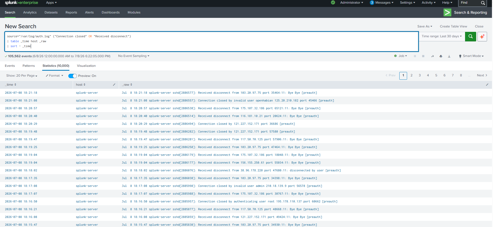

# SSH Disconnect Detection

## Objective

Detect SSH sessions that were disconnected before successful authentication. These events may indicate SSH scanning, brute-force attempts, or attackers probing the server for valid credentials.

---

## Detection Logic

This detection monitors the Linux authentication log (`/var/log/auth.log`) for SSH disconnect events generated by the OpenSSH daemon.

---

## SPL Query

```spl
source="/var/log/auth.log" ("Connection closed" OR "Received disconnect")
| table _time host _raw
| sort - _time
```

---

## Sample Events

Examples of events detected:

```
Connection closed by invalid user admin ...
Received disconnect from 175.107.xxx.xxx ...
Connection closed by authenticating user root ...
Disconnected from invalid user droidbot ...
```

---

## Why This Detection Matters

Attackers frequently disconnect during reconnaissance or after unsuccessful authentication attempts. Monitoring disconnect events helps identify:

- SSH reconnaissance
- Brute-force activity
- Automated scanning tools
- Abnormal SSH session behavior

---

## MITRE ATT&CK Mapping

| Tactic | Technique | Technique ID |
|---------|-----------|--------------|
| Credential Access | Brute Force | T1110 |
| Initial Access | External Remote Services | T1133 |

---

## Investigation Steps

1. Review the source IP address initiating the connection.
2. Determine whether the username targeted is legitimate or invalid.
3. Correlate with other SSH authentication events (e.g., "Invalid user", "Accepted publickey").
4. Check for repeated attempts from the same IP address.
5. Block malicious IPs if necessary using firewall rules.

---

## Expected Outcome

Analysts can quickly identify suspicious SSH connection attempts that terminate before successful authentication, providing early visibility into reconnaissance and brute-force activity.

---

## Screenshot

