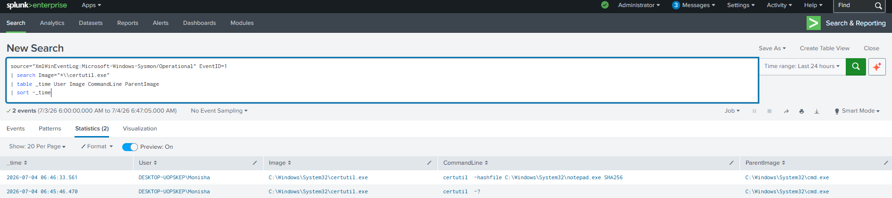

# Certutil Execution Detection

## Objective

Detect execution of `certutil.exe` using Sysmon Event ID 1. Certutil is a legitimate Windows utility frequently abused to download, encode, decode, or transfer malicious payloads.

---

## Data Source

- Windows 10
- Sysmon
- Event ID 1 (Process Creation)

---

## Detection Logic

Monitor execution of `certutil.exe` and inspect command-line arguments.

---

## SPL Query

```spl
source="XmlWinEventLog:Microsoft-Windows-Sysmon/Operational" EventID=1
| search Image="*\\certutil.exe"
| table _time User Image CommandLine ParentImage
| sort - _time
```

---

## Sample Output

| Time | User | Command |
|------|------|---------|
|2026-07-04 11:05:32|Monisha|certutil.exe -urlcache|

---

## Investigation Steps

1. Review command-line arguments.
2. Determine whether files were downloaded.
3. Inspect destination URLs.
4. Verify downloaded files.
5. Correlate with network activity.

---

## MITRE ATT&CK

| Technique | ID |
|-----------|----|
|System Binary Proxy Execution: Certutil|T1218.010|

---

## Why this Detection Matters

Threat actors commonly abuse Certutil to bypass security controls and download malware without requiring external tools. Monitoring Certutil execution enables analysts to detect suspicious file transfers early.

---

## Screenshot

