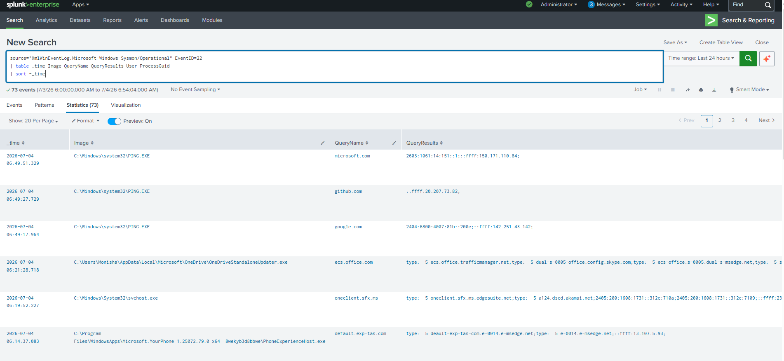

# DNS Query Detection

## Objective

Monitor DNS queries generated by Windows processes using Sysmon Event ID 22. DNS monitoring helps identify suspicious domain lookups, malware beaconing, command-and-control communication, phishing infrastructure, and DNS tunneling attempts.

---

## Data Source

* Windows 10
* Sysmon
* Event ID 22 (DNS Query)

---

## Detection Logic

Monitor all DNS queries and identify the process responsible for each lookup.

---

## SPL Query

```spl
index=main EventID=22
| table _time Computer User Image QueryName QueryStatus QueryResults
```

---

## Sample Output

| Time             | Process        | Domain     |
| ---------------- | -------------- | ---------- |
| 2026-07-04 08:48 | powershell.exe | google.com |

---

## Investigation Steps

1. Identify the originating process.
2. Review the queried domain.
3. Check domain reputation using VirusTotal or another threat intelligence source.
4. Correlate with network connections (Sysmon Event ID 3).
5. Determine whether the DNS request is expected for the process.

---

## MITRE ATT&CK

| Technique                       | ID        |
| ------------------------------- | --------- |
| Application Layer Protocol: DNS | T1071.004 |

---

## Why this Detection Matters

Many malware families rely on DNS to locate command-and-control servers or download additional payloads. Monitoring DNS activity provides early visibility into suspicious outbound communication.

---

## Screenshot


