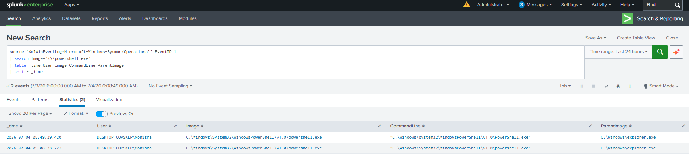

# PowerShell Execution Detection

## Objective

Detect PowerShell execution on Windows endpoints using Sysmon Process Creation events. PowerShell is frequently abused by attackers for executing malicious scripts, downloading payloads, and performing post-exploitation activities.

---

## Data Source

* Windows 10
* Sysmon
* Event ID 1 (Process Creation)

---

## Detection Logic

Monitor all PowerShell process creation events and identify user-initiated executions.

---

## SPL Query

```spl
index=main EventID=1 Image="*powershell.exe"
| table _time Computer User Image CommandLine ParentImage
```

---

## Sample Output

| Time                | User    | Image          | Parent Process |
| ------------------- | ------- | -------------- | -------------- |
| 2026-07-04 05:49:39 | Monisha | powershell.exe | explorer.exe   |

---

## Investigation Steps

1. Verify the user who launched PowerShell.
2. Review the parent process.
3. Inspect the command line arguments.
4. Determine whether execution was interactive or scripted.
5. Correlate with network connections (Sysmon Event ID 3).
6. Correlate with DNS queries (Sysmon Event ID 22).

---

## MITRE ATT&CK

| Technique                                     | ID        |
| --------------------------------------------- | --------- |
| Command and Scripting Interpreter: PowerShell | T1059.001 |

---

## Why this Detection Matters

PowerShell is a legitimate administrative tool but is commonly abused by attackers for malware execution, credential theft, lateral movement, persistence, and downloading additional payloads. Monitoring PowerShell execution helps SOC analysts quickly identify suspicious activity and begin an investigation.

---

## Screenshot

> ## Screenshot

