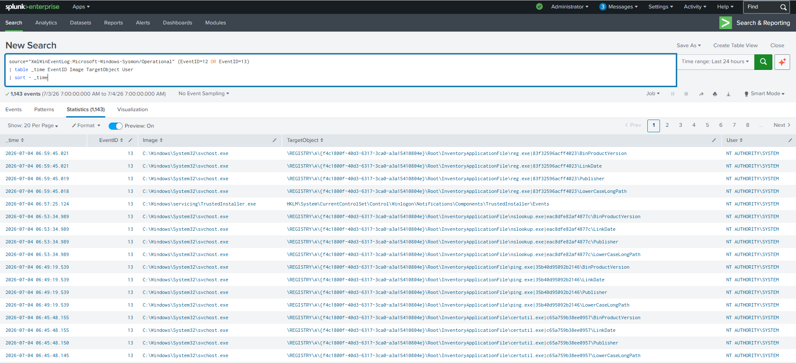

# Registry Modification Detection

## Objective

Detect Windows Registry modifications using Sysmon Event IDs 12 (Registry Object Create/Delete) and 13 (Registry Value Set). Monitoring registry changes helps identify unauthorized system configuration changes and potential attacker activity.

---

## Data Source

- Windows 10
- Sysmon
- Event ID 12 (Registry Object Create/Delete)
- Event ID 13 (Registry Value Set)

---

## Detection Logic

Monitor registry creation, deletion, and value modification events. Review the modified registry path, the process responsible, and the user account performing the action.

---

## SPL Query

```spl
source="XmlWinEventLog:Microsoft-Windows-Sysmon/Operational" (EventID=12 OR EventID=13)
| table _time EventID Image TargetObject User
| sort - _time
```

---

## Sample Output

| Time | Event ID | User | Process | Registry Path |
|------|----------|------|---------|---------------|
|2026-07-04 12:15:40|13|Monisha|reg.exe|HKCU\Software\MonishaLab\TestValue|

---

## Investigation Steps

1. Identify the process that modified the registry.
2. Review the registry path (`TargetObject`) to determine its purpose.
3. Verify whether the change was expected or part of normal system activity.
4. Check if the process is legitimate and digitally signed.
5. Correlate with Process Creation (Sysmon Event ID 1) to understand how the process was launched.
6. Investigate additional activity from the same user or process if the modification appears suspicious.

---

## MITRE ATT&CK

### General Registry Modification

| Tactic | Technique | ID |
|---------|-----------|----|
|Defense Evasion|Modify Registry|T1112|

> **Note:** This detection monitors general registry modifications. Since the modified key (`HKCU\Software\MonishaLab`) is **not** an autorun or persistence location, it is mapped to **T1112 – Modify Registry** rather than a persistence technique.

> If this detection is later updated to monitor registry autorun locations such as:
>
> - `HKCU\Software\Microsoft\Windows\CurrentVersion\Run`
> - `HKLM\Software\Microsoft\Windows\CurrentVersion\Run`
>
> it can additionally be mapped to:
>
> - **Tactic:** Persistence
> - **Technique:** T1547.001 – Registry Run Keys / Startup Folder

---

## Why this Detection Matters

The Windows Registry stores critical operating system and application settings. Attackers often modify registry keys to evade detection, alter system behavior, or prepare for persistence. Monitoring registry modifications provides visibility into suspicious configuration changes and helps SOC analysts investigate potentially malicious activity before it escalates.

---

## Screenshot

