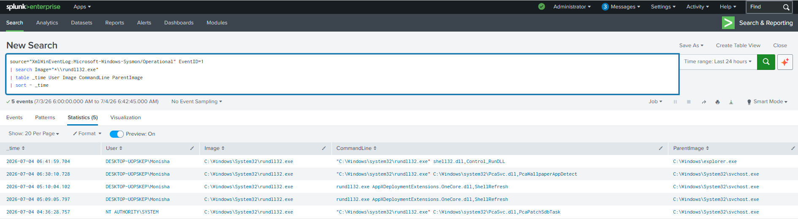

# Rundll32 Execution Detection

## Objective

Detect execution of `rundll32.exe` using Sysmon Event ID 1. Attackers frequently abuse this trusted Windows utility to execute malicious DLLs while bypassing application controls.

---

## Data Source

- Windows 10
- Sysmon
- Event ID 1 (Process Creation)

---

## Detection Logic

Monitor executions of `rundll32.exe` and review the associated command line and parent process.

---

## SPL Query

```spl
source="XmlWinEventLog:Microsoft-Windows-Sysmon/Operational" EventID=1
| search Image="*\\rundll32.exe"
| table _time User Image CommandLine ParentImage
| sort - _time
```

---

## Sample Output

| Time | User | Image | Parent Process |
|------|------|-------|----------------|
|2026-07-04 10:22:11|Monisha|rundll32.exe|explorer.exe|

---

## Investigation Steps

1. Review the DLL being executed.
2. Verify whether the DLL is digitally signed.
3. Check the parent process.
4. Determine whether the execution is expected.
5. Investigate any associated network connections.

---

## MITRE ATT&CK

| Technique | ID |
|-----------|----|
|Trusted Developer Utilities Proxy Execution: Rundll32|T1218.011|

---

## Why this Detection Matters

Attackers often use Rundll32 to execute malicious DLLs while appearing as legitimate Windows activity. Detecting abnormal Rundll32 executions helps identify defense evasion and malware execution techniques.

---

## Screenshot

